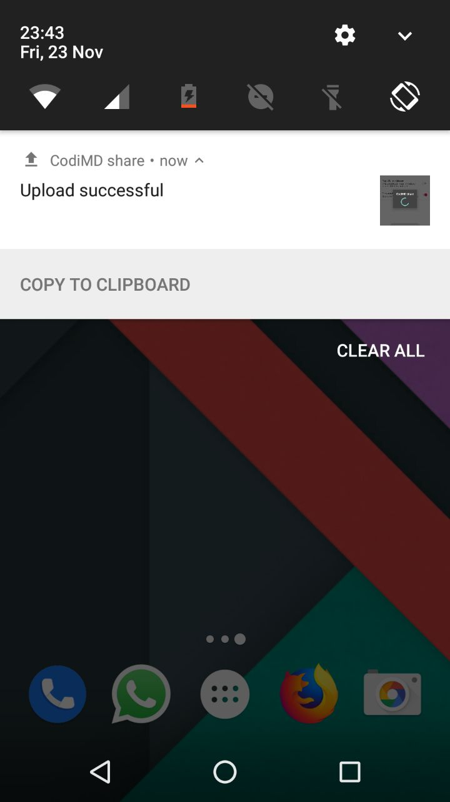
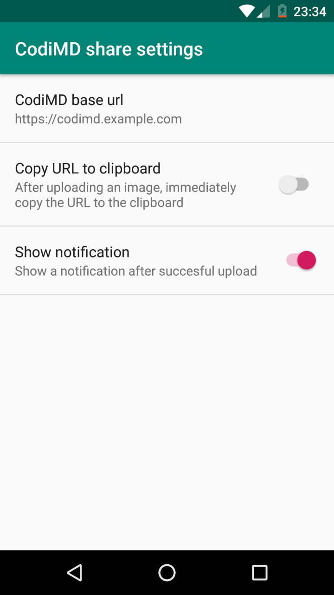

CodiMD share
===

Share your images and videos on directly from Android to your personal CodiMD
instance.

## Installation

Currently there is no app in Google Play. I do not intent to ever publish one.
The user base of CodiMD is not that big and the user base of this app would be
even smaller. For now you will have to compile this app yourself. This can be
easily done with the regular old [Android Studio].

[Android Studio]: https://developer.android.com/studio/

## Getting started

After installing, open the settings screen (screenshot 2) ans provide the base
URL of your CodiMD instance. There's no need for any credentials. CodiMD allows
uploading arbitrary files without the need to log in (maybe we should fix this).

If you are running CodiMD behind a reverse proxy (as you probably should), you
should pay attention to the maximum request size. Images could be too large for
webservers to be accepted. Edit your webserver config to allow larger files.
For example, in nginx you can use this line to allow for uploads up to 50MB:

```
server {
    server_name codimd.example.com
    
    # [lots of lines omitted]
    
    # Allow uploading files up to 50MB
    client_max_body_size 50m;
}
```

## Screenshots

| Notification | Settings |
| ------------ | -------- |
|  |  |

## Contributions and issues

This is just a regular project for myself to make my life easier. If it helps
you, that's awesome! If there's a bug or something is not working quite as
expected, you can [report an issue]. However, this project is not high on my
priority list. This means that I will not implement any new features. You are
free to open pull requests. You can also fork the project, but don't expect a
lot of extra work from my part.

[report an issue]: https://github.com/dsprenkels/codimd-image-share/issues/new